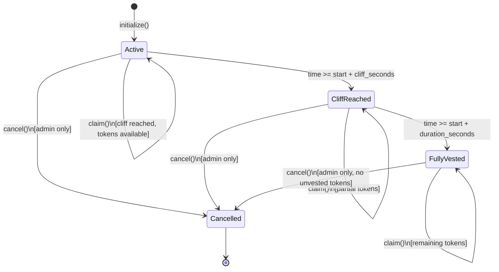
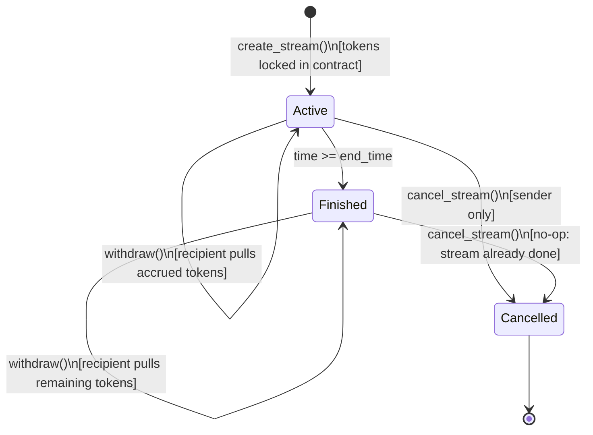
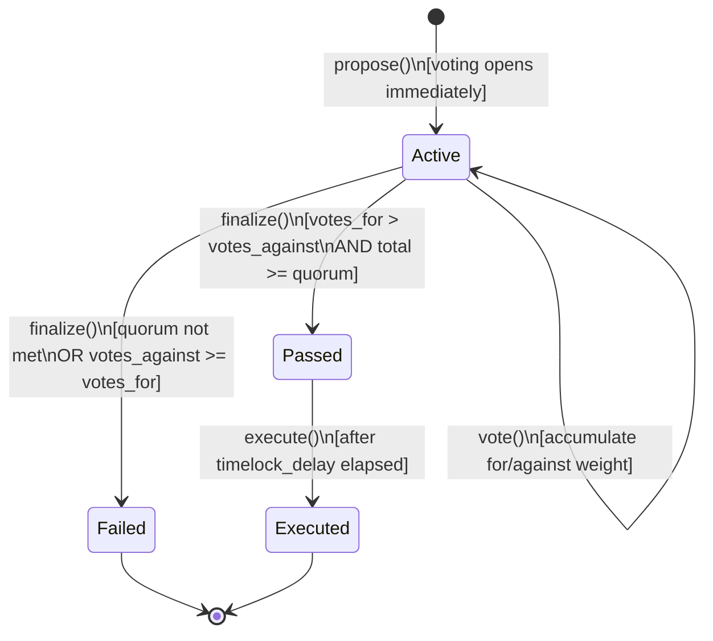

# Contract State Diagrams

Visual lifecycle documentation for stateful StellarForge contracts.

---

## forge-vesting

Tokens vest linearly after a cliff period. The admin can cancel at any time to reclaim unvested tokens.

**Notes:**
- `CliffReached` and `FullyVested` are logical sub-states of `Active` (the `cancelled` flag is the only on-chain state bit).
- `claim()` reverts with `CliffNotReached` before the cliff, `NothingToClaim` if all vested tokens are already withdrawn, and `Cancelled` after cancellation.
- `cancel()` auto-transfers any unvested tokens back to the admin.

---

## forge-stream

Tokens stream per-second from sender to recipient. The sender can cancel early; the recipient can withdraw at any time.

**Notes:**
- `Finished` means `now >= end_time`; the stream is no longer accruing but unclaimed tokens are still withdrawable.
- `cancel_stream()` atomically pays out accrued tokens to the recipient and refunds unstreamed tokens to the sender.
- `withdraw()` reverts with `NothingToWithdraw` if no tokens have accrued since the last withdrawal, and `AlreadyCancelled` on a cancelled stream.

---

## forge-governor

Token-weighted proposals go through voting, optional failure/pass finalization, a timelock delay, and then execution.

**Notes:**
- `finalize()` can only be called after `vote_end` (i.e. `now > vote_start + voting_period`).
- `execute()` reverts with `TimelockNotElapsed` if called before `passed_at + timelock_delay`.
- There is no on-chain `Cancelled` state for proposals in the current implementation.
- Voting weight is caller-supplied; integrators should pass the voter's token balance as `weight`.
